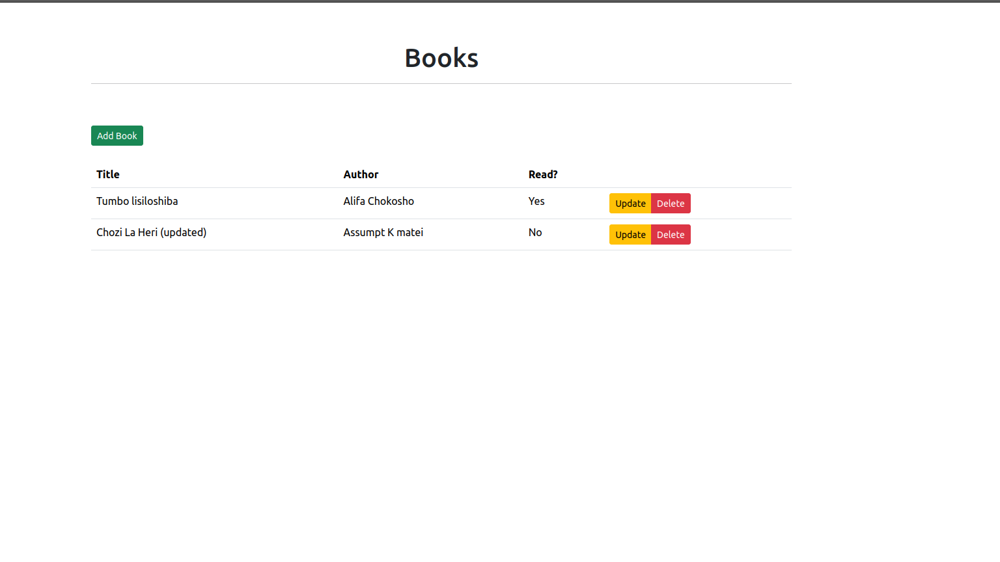

# <h1 align = "center">Flask Vue On Docker</h1>

## Overview 

- Backend Services Writen in Python and flask 
- Frontend written using Vue
- Following Clean Architecture approach.
- Following a test driven approach.(TDD)
- Application developed using CI/CD pipeline (Github Actions)

#